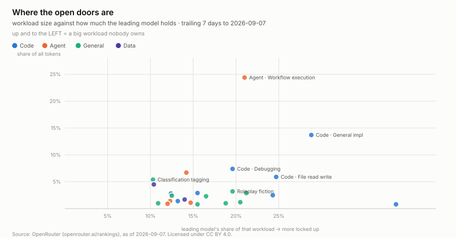
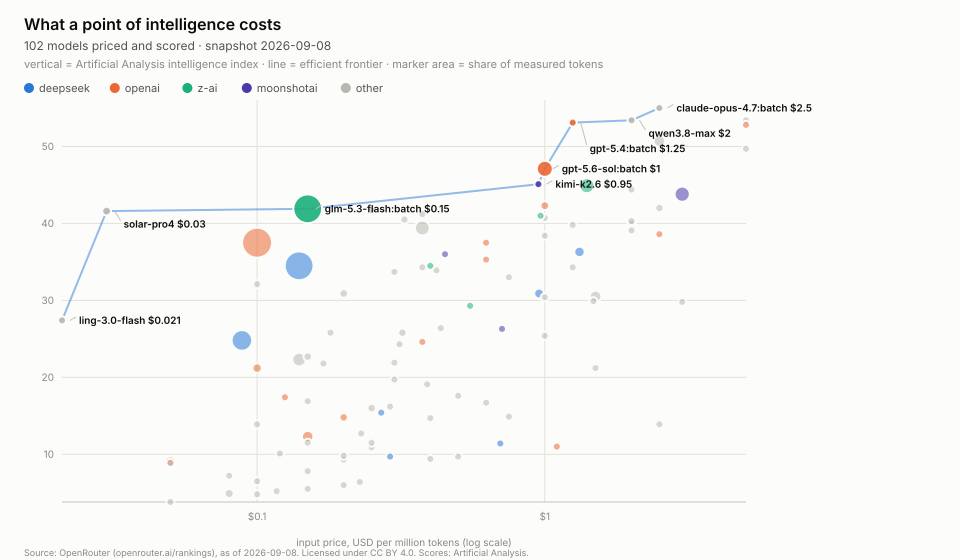
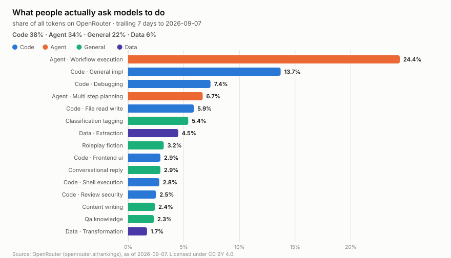
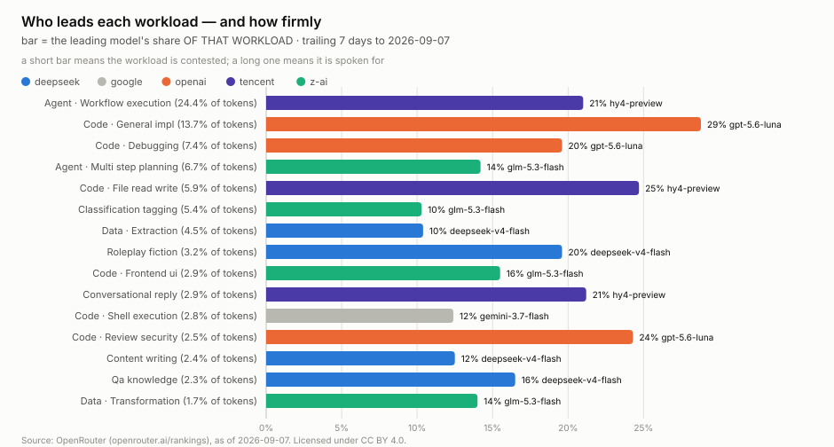

<h1 align="center">wss-openrouter</h1>

<p align="center">
  <strong>What people actually ask AI models to do, captured weekly</strong>
</p>

<div align="center">

  <a href="https://github.com/neldivad/wss-openrouter/actions/workflows/capture-weekly.yml"></a>
  <a href="https://github.com/neldivad/wss-openrouter/commits"></a>
  <a href="https://github.com/neldivad/wss-openrouter/blob/main/LICENSE"></a>
  <a href="https://github.com/neldivad/wss-openrouter"></a>

</div>

<p align="center">
  <sub>fleet: <a href="https://github.com/neldivad/wss-engine">engine</a> · <a href="https://github.com/neldivad/wss-hugging-face">hugging face</a> · <strong>openrouter</strong> · <a href="https://github.com/neldivad/wss-cloud-footprint">cloud footprint</a> · <a href="https://github.com/neldivad/wss-mining-pipeline">mining</a> · <a href="https://github.com/neldivad/wss-forest-harvest">forest</a> · <a href="https://github.com/neldivad/wss-food-trace">food</a></sub>
</p>

The task mix, session economics and benchmark scores here all come from
endpoints with no date parameters: they describe *now*, and last month's
version is already unrecoverable. Model rankings are the exception, and this
repo deliberately does not capture them — see Contributing.



**The biggest workload on the platform is the one nobody owns.** Agentic
workflow execution is 23.5% of all tokens and its leading model holds just 11%
of it. Code workloads (blue) sit right, consolidated; Agent workloads (orange)
sit left, contested.

**Every source, its live URL, its licence and its last stored capture is listed in [SOURCES.md](SOURCES.md)** — generated by `wss sources`, so it cannot drift from the registry.

## Questions this exists to answer

A source that answers no question gets dropped. A question nothing answers is
the next thing to build. Append freely.

| # | Question | Status |
| --- | --- | --- |
| Q1 | Is the task mix shifting — is agentic work growing, and at whose expense? | needs ~8 weeks |
| Q2 | Which workloads are contested and which are locked up? | answered — chart above |
| Q3 | Does a model displace another per workload before it shows in aggregate rankings? | accruing |
| Q4 | Is the cost of a unit of capability falling over time? | accruing |
| Q5 | Which models get quiet price cuts? | accruing |
| Q6 | What does an agent session really cost, over 1 turn versus 50? | answerable |
| Q7 | Stated interest versus revealed use — models everyone downloads but nobody serves. | open — needs the join run |

## What you can build

Charts come from [examples/visualize.py](examples/visualize.py) — stdlib only,
deterministic, no network.



**Q4 — the efficient frontier**, where nothing is both cheaper *and* smarter:
`ling-3.0-flash` (index 37.8 at $0.02/Mtok) up to `claude-opus-5:batch` (63.1
at $2.50). Marker area is share of measured tokens, so you can see which
good-value models people actually run. Everything far below the line is priced
like a flagship and scoring mid-tier.

<details>
<summary>Two more views: token composition, and who leads each workload</summary>





</details>

Cross-source joins use `canonical_slug` — the dated permaslug the benchmark
endpoints key on, not the catalogue's undated `id`. That difference is 96
matches versus 14.

## Using it

**Reading this data needs nothing** — no key, no account, no clone. The API
key below is only for running your own capture:

```bash
B=https://raw.githubusercontent.com/neldivad/wss-openrouter/main/derived/observations
duckdb -c "SELECT * FROM read_csv_auto('$B/2026-09.csv') LIMIT 5"
```

```bash
head derived/observations/*.csv          # one row per entity/metric/day
python examples/load_observations.py     # sqlite + example queries
python examples/visualize.py             # regenerate every chart
```

Columns are `series_id, entity_id, observed_at, captured_at, metric, value,
unit, source_id, raw_ref, parser_version`. `entity_id` is namespaced so
sources join on it: `task:agent:workflow_execution`,
`task:<tag>/model:<id>`, `app:claude-code/turns:50-plus-turns/model:<slug>`,
or a bare model permaslug.

**One gotcha.** Several sources restate the same `observed_at` on every
capture — the task mix describes a trailing week, so three captures produce
three rows for it. That is deliberate: it is how a *revision* becomes visible.
But it means naive filters double-count, so deduplicate on
`(series_id, entity_id, metric, observed_at)` taking the latest `captured_at`.
Every query in [examples/queries.sql](examples/queries.sql) shows the pattern.

Six weekly sources — task classifications, three benchmark sets, session costs
and the model catalogue — captured Mondays 22:35 UTC by the
[wss](https://github.com/neldivad/wss-engine) engine. Coverage dates live in
[health/health.csv](health/health.csv).

## Contributing

**The test for a new source: which open question does it close?** If the
answer is "none", it does not go in.

That rule is why `rankings-daily` is absent. OpenRouter archives per-model
token volumes back to 2025-01-01 in windows up to 366 days, so capturing them
would rebuild an archive that already exists — and `wss validate` rejects such
a source outright (`destroys_own_history: false`). Query it directly when you
need it, citing their `meta.as_of`. An earlier version of this repo scraped an
undocumented endpoint for the same numbers; it has been removed.

### Running your own capture

OpenRouter's Data API is gated by **the same key that authorises paid
inference on your account** — treat it as a payment credential, not a read
token. Create a dedicated key at
[openrouter.ai/settings/keys](https://openrouter.ai/settings/keys), set a
spend limit, then:

```bash
cp .env.example .env.local
$EDITOR .env.local     # OPENROUTER_API_KEY and WSS_CONTACT
chmod 600 .env.local   # gitignored; verify with: git check-ignore -v .env.local
```

For CI, add both as repository secrets. The registry holds only the variable's
*name* (`auth: {bearer_env: OPENROUTER_API_KEY}`); the engine sends it as a
header, and it never reaches `raw/`, the manifest or any log. Rate limits are
30/minute and 500/day — ample for six weekly sources.

## Caveats

- **Classifications are sampled** and published as shares only. No absolute
  volumes; composition is the question this answers.
- **OpenRouter is not the market** — one router, developer-skewed, with its
  own model mix. A proxy for production usage, not a census.
- **Benchmark scores are third-party.** Artificial Analysis and Design Arena
  set their own methodologies; cite the originator.

## Licences

Code MIT; data CC-BY-4.0. OpenRouter's Data API is itself CC BY 4.0 and
requires this citation when republishing figures:

> Source: OpenRouter (openrouter.ai/rankings), as of &lt;meta.as_of&gt;.
> Licensed under CC BY 4.0.

The `as_of` value is preserved as `observed_at` on every row, so the citation
reconstructs from the data itself.

Topics: `git-scraping` · `open-data` · `point-in-time-data` · `dataset`
